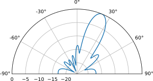
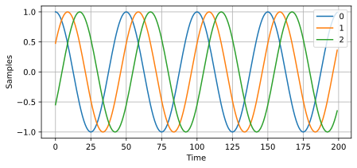
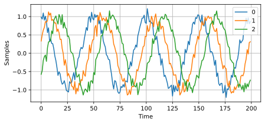
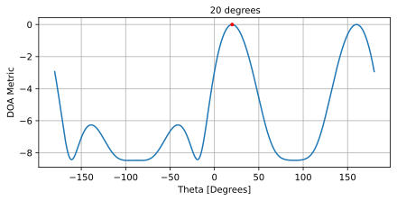
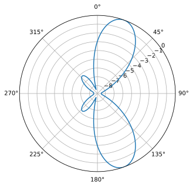
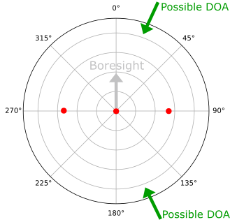
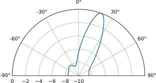
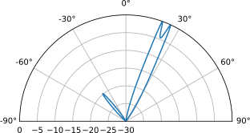
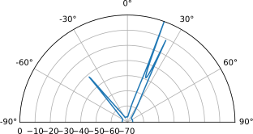
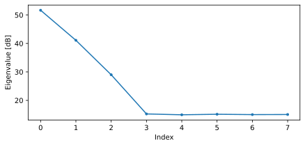

.. _doa-chapter:

####################################
Пеленгація (DOA) & Формування променя / Формування діаграми промення (Beamforming)
####################################

У цій главі ми загалом розглядаємо поняття формування діаграми, пеленгації (DOA) і фазованих решіток.  Ми порівнюємо різні типи і геометрії решіток і покажемо, яку важливу роль відіграє відстань між елементами решіток. Такі алгоритми, як MVDR/Capon і MUSIC, будуть представлені і продемонстровані в прикладах симуляції на Python.

************************
Огляд формування діаграми
************************

Фазовані решітки, також відомі як решітки з електронним керуванням, - це сукупність антен, які можуть використовуватися на стороні як передачі так і прийому для формування діаграми променів в одному або декількох бажаних напрямках.  Вони використовуються як у зв'язку, так і в радіолокації, і ви знайдете їх у наземних, повітряних та супутникових системах. Зазвичай ми називаємо антени, з яких складається решітка, елементами, а іноді решітку називають «датчиком». Ці елементи решітки найчастіше є всеспрямованими антенами, розташовані на одній ліній на однакових відстаях, а бо на однакових відстанях але в двох вимірах в площині. 

Формування діаграми спрямованості - це операція обробки сигналу, за допомогою антенних решіток для створення просторового фільтра; він фільтрує сигнали з усіх напрямків, окрім потрібного нам напрямку (напрямків). Формування діаграми променя може використовуватися для підвищення С/Ш (SNR) бажаних сигналів, обнулення перешкод, формування діаграми спрямованості або навіть для передачі/прийому декількох потоків даних одночасно на однакових частотах. У процесі формування діаграми спрямованості ми використовуємо ваги (так звані коефіцієнти), які застосовуються до кожного елемента масиву, як у цифровому, так і в аналоговому вигляді. Ми маніпулюємо вагами, щоб сформувати промінь (промені) решітки, звідси і назва - формування діаграми променя! Ми можемо керувати напямками цих променів (і областями затемнення) надзвичайно швидко; набагато швидше, ніж це можно робити з напрямком діаграм антенами з механічним керуванням, які можно розглядати як альтернативу фазованим решіткам. Зазвичай ми будемо розглядати формування діаграми спрямованості в контексті лінії зв'язку, де приймач має отримати один або кілька сигналів з максимально можливим SNR. Антенні решітки також відіграють величезну роль у радіолокації, де треба виявляти і відстежувати цілі.

Підходи до формування променя можна розділити на три типи: звичайне, адаптивне і сліпе. Звичайне формування променя найбільш використовується, коли ви заздалегідь знаєте напрямок приходу вашого сигналу, і процес формування променя полягає у виборі вагових коефіцієнтів для максимізації підсилення антенної решітки в цьому напрямку. Це формування може бути як на стороні прийому, так і на стороні передачі системи зв'язку. Адаптивне формування променя, з іншого боку, зазвичай передбачає коригування вагових коефіцієнтів на основі вхідних даних формувача променя для оптимізації деяких критеріїв (наприклад, зведення до нуля перешкод, наявність декількох основних променів тощо). Через замкнутий цикл і адаптивну природу, адаптивне формування променя зазвичай використовується тільки на стороні прийому, тому «вхідним сигналом» є просто ваш прийнятий сигнал, а адаптивне формування променя включає в себе коригування ваг на основі статистики отриманих даних.

У наведенему нижче рисунку представлена класифікація видів формування променя, а також наведено приклади методів для їх створення:

.. image:: ../_images/beamforming_taxonomy.svg
   :align: center 
   :target: ../_images/beamforming_taxonomy.svg
   :alt: A beamforming taxonomy, categorizing beamforming into conventional, adaptive, and blind, as well as showing how direction of arrival (DOA) estimation fits in

******************************
Огляд пеленгації
******************************

Пеленгація Direction-of-Arrival (DOA) в ЦОС (DSP)/SDR відноситься до процесу використання решітки антен для виявлення і оцінки напрямків приходу одного або декількох сигналів, отриманих цією решітикою (на відміну від формування променя, для прийому сигналу з найбільшим придушення шуму і перешкод).  Хоча пеленгація (DOA), безумовно, підпадає під категорію формування променя, ці два терміни можна зплутати.  Деякі методи, такі як звичайне і MVDR-формування променя, можуть застосовуватися як для пеленгації (DOA), так і для формування променя, оскільки той самий метод, що використовується для формування променя, використовується для пеленгації (DOA) шляхом розгортки за кутом, і виконання операції формування променя для кожного значення кута, а потім пошуку піків у результатах для кожного з значень цих кутів (кожен пік є сигналом, але ми не знаємо, чи це сигнал, що нас цікавить, перешкода або навіть багатопроменевий відбиття сигналу, що нас цікавить). Ви можете думати про ці методи пеленгації (DOA) як про обгортку певного виду формування променя.  Інші типи формування променя не можуть бути просто обгорткою до процедури пеленгації DOA, наприклад, через додаткові вхідні дані, які будуть недоступні в контексті пеленгації (DOA). Існують також методи пеленгації, такі як MUSIC і ESPIRT, які призначені виключно для пеленгації і не є методами формування променя.  Оскільки більшість методів формування променя припускають, що ви знаєте кут приходу сигналу, який вас цікавить, якщо ціль рухається або рухається решітка, вам доведеться постійно виконувати пеленгацію DOA як проміжний етап, навіть якщо вашою основною метою є прийом і демодуляція сигналу, який вас цікавить.

Фазовані антенні решітки і формування діаграми спрямованості/DOA знаходять застосування в різних сферах, хоча найчастіше їх використовують у різних формах радарів, нових стандартах WiFi, зв'язку mm-хвиль в рамках 5G, супутниковому зв'язку і боротьбі із завадами. Загалом, будь-які задачі, які потребують антени з високим коефіцієнтом підсилення або швидко рухомої антени з високим коефіцієнтом підсилення, є хорошими кандидатами для тогог, щоб розглянути використання фазованих решіток.

******************
Типи решіток
******************

Фазовані антенні решітки можна розділити на три типи:

1. **Аналогові**, так звані пасивні фазовані антені решітки (PESA) або традиційні фазовані решітки, де для керування променем використовуються аналогові фазообертачі. На стороні прийому всі елементи підсумовуються після фазового зсуву (і, опціонально, регульованого посилення) і перетворюються в канал сигналу, який конвертується в нижній діапазон частот і приймається. На стороні передачі відбувається зворотний процес: виводиться один цифровий сигнал, який пза допомогою фазообертачів і підсилювачів перетворюється для отримання вихідного сигналу кожної антени. Ці цифрові фазообертачі та затримки мають обмежену кількість бітів роздільної здатності.
2. **Цифрові**, також відомі як активні решітки з електронним скануванням (AESA), в яких кожен елемент має власну радіочастотну частину, а формування діаграми спрямованості здійснюється повністю в цифровій області. Це найдорожчий підхід, оскільки радіочастотні компоненти є дорогими, але він забезпечує набагато більшу гнучкість і швидкість, ніж PESA. Цифрові решітки зручно використовувати з SDR, але кількість каналів прийому або передачі SDR обмежують кількість елементів вашої решітки.
3. **Гібридні**, які складаються з підмасивів, які є аналоговими, тобто кожен підмасив має власну радіочастотну частину.  Це найпоширеніший підхід для сучасних фазованих решіток, оскільки він бере найкраще з обох видів решіток.

Приклад кожного з типів наведено нижче.

.. image:: ../_images/beamforming_examples.svg
   :align: center 
   :target: ../_images/beamforming_examples.svg
   :alt: Приклад фазованих решіток, включаючи пасивну решітку з електронним скануванням (PESA), активну решітку з електронним скануванням (AESA), гібридну решітку, радар MIM-104 Patriot компанії Raytheon, ізраїльський багатоцільовий радар ELM-2084, термінал користувача Starlink, також відомий як Dishy

На додаток до цих трьох типів, існує також класифікація за геометрією антенної решітки. Найпростіша геометрія - це рівномірна лінійна решітка (ULA), де антени розташовані на одній прямій лінії на однакових відстаннях (тобто на одній осі). ULA мають 180-градусну неоднозначність напрямку приходу, про яку ми поговоримо пізніше, і одним з рішень цієї неоднозначності є розміщення антен по колу, яке називається рівномірною круговою антенною решіткою (UCA). І нарешті, для 2D-променів ми зазвичай використовуємо рівномірну прямокутну решітку (URA), де антени розташовані у вигляді сітки.

У цій главі ми зосередимося на цифрових решітках, оскільки вони більше підходять для моделювання та DSP, але ці ж концепції переносяться на аналогові та гібридні решітки.  У наступному розділі ми попрацюємо з SDR «Phaser» від Analog Devices, який має 8-елементний аналоговий масив на 10 ГГц з обертачами фази і регульованими підсилювачами, підключений до Pluto і Raspberry Pi.  Ми також зосередимося на геометрії ULA, оскільки вона забезпечує найпростішу математику і код, але всі концепції переносяться на інші геометрії, і в кінці глави ми торкнемося UCA.

*******************
Вимоги до SDR
*******************

Як зазначалося, аналогові фазовані решітки включають аналоговий фазообертач (і, як правило, підсилювачі з регульований коефіцієнт підсилення) на кожен канал, тобто аналогова фазована решітка - це спеціальне обладнання, яке повинно йти разом з SDR.  З іншого боку, будь-яка SDR, що містить більше одного каналу, може використовуватися як цифрова решітка без додаткового обладнання, якщо ці канали фазово когерентні і дискретизуються з використанням одного і того ж тактового генератора, що, як правило, має місце для SDR, які мають кілька каналів прийому.  Існує багато SDR, які містять **два** канали прийому, наприклад, Ettus USRP B210 і Analog Devices Pluto (2-й канал виводиться за допомогою роз'єму uFL на самій платі).  На жаль, більше ніж два каналу мають SDR приймачів вартістю понад $10 тис., принаймні у 2023 року, такі як, наприклад, USRP N310.  Основна проблема полягає в тому, що недорогі SDR, як правило, не можуть бути "об'єднуватися" разом для підвищення кількості каналів.  Винятком є KerberosSDR (4 канали) і KrakenSDR (5 каналів), які використовують декілька RTL-SDR, що мають спільний LO для формування недорогого цифрового масиву; недоліком є дуже обмежена частота дискретизації (до 2,56 МГц) і діапазон налаштування (до 1766 МГц).  Плата KrakenSDR і приклад конфігурації антени показані нижче.

.. image:: ../_images/krakensdr.jpg
   :align: center 
   :alt: The KrakenSDR
   :target: ../_images/krakensdr.jpg

У цій главі ми не використовуємо жодних конкретних SDR; натомість ми моделюємо прийом сигналів за допомогою Python, а потім розглядаємо цифрову обробку сигналів у цифрових решітках для формування формування діаграми направленості/пеленгації (DOA).

**************************************
Вступ до матричної математики за допомогою Python/NumPy
**************************************

Python має багато переваг над MATLAB, він безкоштовний і має відкритий код, використовується в багатьох областях, має активну спільноту, індекси масивів починаються з 0, як і в будь-якій іншій мові, використовується в AI/ML, і, здається, для нього є бібліотеки для майже будь-якого застосунку, що ви можете собі уявити.  Але недоліком є те, як кодуються/представляються матриці і як виконуєтьтся їх обробка (з точки зору обчислень/швидкості, обчислення досить швидкі, тому що функції "під капотом" ефективно реалізовані на C/C++).  Не допомагає і те, що у Python існує декілька способів представлення матриць, метод :code:`np.matrix` застарілий, замість нього треба використовувати :code:`np.ndarray`.  У цьому розділі ми надаємо короткий посібник з виконання матричних обчислень у Python за допомогою NumPy, для того щоб коли ми перейдемо до прикладів з пеленгації (DOA), ви почували себе більш комфортно.

Давайте почнемо з найбільш дратівливої частини матричної математики в NumPy: вектори розглядаються як одновимірні масиви, тому не можна відрізнити вектор-рядок від вектора-стовпця (за замовчуванням він буде розглядатися як вектор-рядок), в той час як в MATLAB вектор є двовимірним об'єктом.  У Python ви можете створити новий вектор за допомогою :code:`a = np.array([2,3,4,5])` або перетворити список у вектор за допомогою :code:`mylist = [2, 3, 4, 5]`, а потім :code:`a = np.asarray(mylist)`, але як тільки ви захочете виконати будь-які матричні обчислення, орієнтація вектора має значення, і він буде інтерпретуватися як вектор-рядок.  Спроба виконати транспонування цього вектора, наприклад, за допомогою :code:`a.T`, **не** перетворить його на вектор-стовпець!  Спосіб зробити вектор-стовпець зі звичайного вектора :code:`a` полягає у використанні :code:`a = a.reshape(-1,1)`.  Код :code:`-1` вказує NumPy обчислити розмір цього виміру автоматично, зберігаючи довжину другого виміру 1. Технічно це створює двовимірний масив, але другий вимір має довжину 1, тому з математичної точки зору він все одно залишається одновимірним. Це лише один додатковий рядок, але він дійсно може зіпсувати хід матричних обчислень.

А тепер короткий приклад матричної математики у Python: ми перемножимо матрицю :code:`3x10` на матрицю :code:`10x1`.  Пам'ятайте, що :code:`10x1` означає 10 рядків і 1 стовпець, відомий як вектор-стовпець, оскільки він складається лише з одного стовпця.  Зі школи ми знаємо, що це правильно для множення матриць, внутрішні розміри збігаються, а розмір результуючої матриці дорівнює зовнішнім розмірам, тобто :code:`3x1`.  Для зручності ми будемо використовувати :code:`np.random.randn()` для створення :code:`3x10` і :code:`np.arange()` для створення :code:`10x1`:

.. code-block:: python

 A = np.random.randn(3,10) # 3x10
 B = np.arange(10) # 1D array of length 10
 B = B.reshape(-1,1) # 10x1
 C = A @ B # matrix multiply
 print(C.shape) # 3x1
 C = C.squeeze() # дивись наступну підсекцію
 print(C.shape) # 1D масив з довжиною 3, легше для виводу і іншого коду Python, що не пов'язаний з обробкою матриць

Після виконання матричних обчислень ви бачите, що ваш результат виглядає приблизно так: :code:`[[ 0. 0.125 0.251 -0.376 -0.251 ...]]`, який явно має лише один вимір даних, але якщо ви спробуєте побудувати графік з цих значень, ви отримаєте або помилку, або графік, на якому нічого не відобразиться.  Це пов'язано з тим, що результат технічно є двовимірним масивом, а вам потрібно перетворити його в одновимірний масив за допомогою :code:`a.squeeze()`.  Функція :code:`a.squeeze()` видаляє будь-які розмірності з довжиною 1, і є дуже корисною при виконанні матричних обчислень у Python.  У наведеному вище прикладі результатом буде :code:`[ 0. 0.125 0.251 -0.376 -0.251 ...]` (зверніть увагу що пропали другі квадратні дужки), тепер цей вектор можна побудувати або використати в іншому Python-коді, де треба 1D вектори.

При обчисленнях матриць найкращою перевіркою на коректність є виведення розмірностей (за допомогою функції :code:`A.shape`), щоб переконатися, що вони є правильними. Рекомендуємо вставляти розмірності в коментарі після кожного рядка, щоб у подальшому легко було переконатися, що розмірності збігаються при виконанні матричного або поелементного множення.

Нижче наведено деякі загальні операції в MATLAB і Python, можете використвувати це, як своєрідну шпаргалку:

.. list-table::
   :widths: 35 25 40
   :header-rows: 1

   * - Оператор
     - MATLAB
     - Python/NumPy
   * - Створити (Рядок) Вектор, розмір :code:`1 x 4`
     - :code:`a = [2 3 4 5];`
     - :code:`a = np.array([2,3,4,5])`
   * - Створити Стовпчик Вектор, size :code:`4 x 1`
     - :code:`a = [2; 3; 4; 5];` або :code:`a = [2 3 4 5].'`
     - :code:`a = np.array([[2],[3],[4],[5]])` or |br| :code:`a = np.array([2,3,4,5])` then |br| :code:`a = a.reshape(-1,1)`
   * - Створити 2D Матрицю
     - :code:`A = [1 2; 3 4; 5 6];`
     - :code:`A = np.array([[1,2],[3,4],[5,6]])`
   * - Взяти розмірність
     - :code:`size(A)`
     - :code:`A.shape`
   * - Транспонувати тобто :math:`A^T`
     - :code:`A.'`
     - :code:`A.T`
   * - Комплексне спряжене транспонування |br| також відоме як Спряжене ТранспонуванняConjugate |br| також відоме як ермітове транспонуванн |br| тобто :math:`A^H`
     - :code:`A'`
     - :code:`A.conj().T` |br| |br| (unfortunately there is no :code:`A.H` for ndarrays)
   * - Поелементне множення
     - :code:`A .* B`
     - :code:`A * B` or :code:`np.multiply(a,b)`
   * - Матричне множення
     - :code:`A * B`
     - :code:`A @ B` or :code:`np.matmul(A,B)`
   * -  Точковий добуток двох векторів (1D)
     - :code:`dot(a,b)`
     - :code:`np.dot(a,b)` (never use np.dot for 2D)
   * - Конкатенація
     - :code:`[A A]`
     - :code:`np.concatenate((A,A))`

***************************
Математичний аналіз решіток
***************************

Щоб перейти до найцікавішого, нам доведеться трохи розібратися з математикою, але наступний розділ написаний таким чином, щоб математика була надзвичайно простою, і присутні діаграмами, використовуються лише найпростіші тригонометричні та експоненціальні властивості.  Важливо розуміти базову математику, яка лежить в основі того, що ми будемо робити в Python для виконання DOA.

Розглянемо одновимірний триелементний рівномірно розподілений масив:

.. image:: ../_images/doa.svg
   :align: center 
   :target: ../_images/doa.svg
      :alt: Діаграма, що показує напрямок приходу (DOA) сигналу, який падає на рівномірно розташовану антенну решітку, із зазначенням кута нахилу та відстані між елементами або діафрагмами

У цьому прикладі сигнал надходить з правого боку, тому першим він потрапляє на крайній правий елемент.  Давайте обчислимо затримку між моментом, коли сигнал потрапляє на цей перший елемент, і моментом, коли він досягає наступного елемента.  Ми можемо зробити це, сформувавши наступну тригонометричну задачу, спробуйте візуалізувати, як цей трикутник був сформований з наведеної вище діаграми.  Відрізок, виділений червоним кольором, показує відстань, яку повинен пройти сигнал *після* того, як він досягне першого елемента, перш ніж потрапить на наступний.

.. image:: ../_images/doa_trig.svg
   :align: center 
   :target: ../_images/doa_trig.svg
    :alt: Триг, пов'язаний з напрямком прибуття (DOA) рівномірно розташованого масиву

Якщо ви пам'ятаєте SOH CAH TOA, в даному випадку нас цікавить "прилегла" сторона і у нас є довжина гіпотенузи (:math:`d`), тому нам потрібно використовувати косинус:

.. math::
  \cos(90 - \theta) = \frac{\mathrm{adjacent}}{\mathrm{hypotenuse}}

Ми повинні знайти суміжність, оскільки саме вона покаже нам, яку відстань повинен пройти сигнал між потраплянням на перший і другий елемент, щоб він став суміжним :math:`= d \cos(90 - \theta)`.  Тепер існує тригонометрична тотожність, яка дозволяє нам перетворити це в сусідній :math:`= d \sin(\theta)`.  Однак це лише відстань, нам потрібно перетворити її на час, використовуючи швидкість світла: час, що минув :math:`= d \sin(\theta) / c` [секунди].  Це рівняння застосовується між будь-якими сусідніми елементами нашого масиву, хоча ми можемо помножити все це на ціле число для обчислення між несуміжними елементами, оскільки вони розташовані рівномірно (ми зробимо це пізніше).  

Тепер пов'яжемо цю математику тригонометрії та швидкості світла зі світом обробки сигналів.  Позначимо наш передавальний сигнал у базовій смузі :math:`s(t)` і він передається на деякій несучій, :math:`f_c`, тому передавальний сигнал має вигляд :math:`s(t) e^{2j \pi f_c t}`.  Скажімо, цей сигнал потрапляє на перший елемент у момент часу :math:`t = 0`, що означає, що він потрапляє на наступний елемент через :math:`d \sin(\theta) / c` [секунд], як ми обчислили вище.  Це означає, що 2-й елемент отримує:

.. math::
 s(t - \Delta t) e^{2j \pi f_c (t - \Delta t)}

.. math::
 \mathrm{where} \quad \Delta t = d \sin(\theta) / c

Нагадаємо, що коли у вас є часовий зсув, він віднімається від часового аргументу.

Коли приймач або SDR виконує процес пониження частоти для прийому сигналу, він по суті множить його на несучу, але у зворотному напрямку, тому після виконання пониження частоти приймач бачить:

.. math::
 s(t - \Delta t) e^{2j \pi f_c (t - \Delta t)} e^{-2j \pi f_c t}

.. math::
 = s(t - \Delta t) e^{-2j \pi f_c \Delta t}

Тепер ми можемо зробити невеликий трюк, щоб спростити це ще більше; розглянемо, як, коли ми робимо вибірку сигналу, його можна змоделювати, замінивши :math:`t` на :math:`nT`, де :math:`T` - період вибірки, а :math:`n` - це просто 0, 1, 2, 3...  Підставивши це, отримаємо :math:`s(nT - \Delta t) e^{-2j \pi f_c \Delta t}`. Що ж, :math:`nT` настільки більше за :math:`\Delta t`, що ми можемо позбутися першого доданка :math:`\Delta t` і залишимось з :math:`s(nT) e^{-2j \pi f_c \Delta t}`.  Якщо частота дискретизації коли-небудь стане достатньо швидкою, щоб наблизитися до швидкості світла на крихітній відстані, ми можемо повернутися до цього питання, але пам'ятайте, що наша частота дискретизації повинна бути лише трохи більшою за пропускну здатність сигналу, який нас цікавить.

Давайте продовжимо з цією математикою, але почнемо представляти речі в дискретних термінах, щоб це краще нагадувало наш код на Python.  Останнє рівняння можна представити наступним чином, давайте знову вставимо :math:`\Delta t`:

.. math::
 s[n] e^{-2j \pi f_c \Delta t}

.. math::
 = s[n] e^{-2j \pi f_c d \sin(\theta) / c}

Ми майже закінчили, але, на щастя, є ще одне спрощення, яке ми можемо зробити.  Згадайте співвідношення між центральною частотою і довжиною хвилі: :math:`\lambda = \frac{c}{f_c}` або форму, яку ми будемо використовувати: :math:`f_c = \frac{c}{\lambda}`.  Підставивши це, отримаємо:

.. math::
 s[n] e^{-2j \pi \frac{c}{\lambda} d \sin(\theta) / c}

.. math::
 = s[n] e^{-2j \pi d \sin(\theta) / \lambda}

У DOA нам подобається представляти :math:`d`, відстань між сусідніми елементами, як частку довжини хвилі (замість метрів), найпоширенішим значенням для :math:`d` під час проектування масиву є використання половини довжини хвилі. Незалежно від того, що таке :math:`d`, з цього моменту ми будемо представляти :math:`d` як частку довжини хвилі замість метрів, що спрощує рівняння і весь наш код:

.. math::
 s[n] e^{-2j \pi d \sin(\theta)}

Це для сусідніх елементів, для :math:`k`'-го елемента нам просто потрібно помножити :math:`d` на :math:`k`:

.. math::
 s[n] e^{-2j \pi d k \sin(\theta)}

І все готово! Це рівняння, наведене вище, є тим, що ви побачите у статтях DOA та повсюдних реалізаціях! Зазвичай ми називаємо цей експоненціальний член "коефіцієнтом масиву" (часто позначається як :math:`a`) і представляємо його як масив, одновимірний масив для одновимірної антенної решітки тощо.  У python :math:`a` це:

.. code-block:: python

 a = [np.exp(-2j*np.pi*d*0*np.sin(theta)), np.exp(-2j*np.pi*d*1*np.sin(theta)), np.exp(-2j*np.pi*d*2*np.sin(theta)), ...] # зверніть увагу на зростаюче k
 # або
 a = np.exp(-2j * np.pi * d * np.arange(Nr) * np.sin(theta)) # де Nr - кількість елементів приймальної антени

Зверніть увагу, що елемент 0 дає 1+0j (тому що :math:`e^{0}=1`); це має сенс, оскільки все вище було відносно цього першого елемента, тому він приймає сигнал як є, без будь-яких відносних фазових зсувів.  Це чисто математично, насправді будь-який елемент можна вважати еталонним, але, як ви побачите в нашому математичному коді пізніше, важлива різниця у фазі/амплітуді, отримана між елементами.  Це все відносно.

*******************
Отримання сигналу
*******************

Давайте використаємо концепцію коефіцієнта масиву для моделювання сигналу, що надходить на масив.  Для передавання сигналу ми поки що будемо використовувати просто тон:

.. code-block:: python

 import numpy as np
 import matplotlib.pyplot as plt
 
 sample_rate = 1e6
 N = 10000 # кількість семплів для симуляції
 
 # створюємо тон, який буде виступати в якості сигналу передавача
 t = np.arange(N)/sample_rate # вектор часу
 f_tone = 0.02e6
 tx = np.exp(2j * np.pi * f_tone * t)

Тепер змоделюємо антенну решітку, що складається з трьох всеспрямованих антен, розташованих в лінію, з відстанню між сусідніми антенами в 1/2 довжини хвилі (так званий "інтервал у півхвилі").  Ми змоделюємо сигнал передавача, що приходить на цю решітку під певним кутом, тета.  Розуміння коефіцієнта решітки :code:`a`, наведеного нижче, є причиною того, що ми пройшли через усю цю математику вище.

.. code-block:: python

 d = 0.5 # половина довжини хвилі
 Nr = 3
 theta_degrees = 20 # напрямок приходу (не соромтеся змінювати це значення, воно довільне)
 theta = theta_degrees / 180 * np.pi # перевести в радіани
 a = np.exp(-2j * np.pi * d * np.arange(Nr) * np.sin(theta)) # коефіцієнт масиву
 print(a) # зверніть увагу, що це масив 1х3, він комплексний і перший елемент 1+0j

Щоб застосувати коефіцієнт масиву, нам потрібно виконати матричне множення :code:`a` і :code:`tx`, тому спочатку перетворимо їх у матриці, як масиви NumPy, які не дозволяють нам виконувати одномірні матричні обчислення, які нам потрібні для формування променя/DOA.  Потім ми виконаємо матричне множення, зауважте, що символ @ у Python означає матричне множення (це фішка NumPy).  Ми також повинні перетворити :code:`a` з вектора-рядка у вектор-стовпець (уявіть, що він повертається на 90 градусів) так, щоб внутрішні розміри матричного множення збігалися.

.. code-block:: python

 a = np.asmatrix(a)
 tx = np.asmatrix(tx)

 r = a.T @ tx # не звертайте уваги на транспонування a, головне, що ми множимо коефіцієнт масиву на сигнал tx
 print(r.shape) # тепер r буде двовимірним масивом, 1D - час і 1D - просторовий вимір

Наразі :code:`r` є двовимірним масивом, розміром 3 x 10000, оскільки у нас є три елементи масиву і змодельовано 10000 відліків.  Ми можемо витягнути кожен окремий сигнал і побудувати графік перших 200 відліків, нижче ми покажемо лише дійсну частину, але є ще й уявна частина, як і у будь-якого сигналу базової смуги.  Однією з неприємних особливостей Python є необхідність перемикання на матричний тип для матричної математики, а потім повернення до звичайних масивів NumPy, тому нам потрібно додати .squeeze(), щоб повернути його до звичайного 1D масиву NumPy.

.. code-block:: python

 plt.plot(np.asarray(r[0,:]).squeeze().real[0:200]) # asarray і squeeze - це просто прикрість, яку нам доводиться робити, тому що ми прийшли з матриці
 plt.plot(np.asarray(r[1,:]).squeeze().real[0:200])
 plt.plot(np.asarray(r[2,:]).squeeze().real[0:200])
 plt.show()

Зверніть увагу на фазові зсуви між елементами, як ми і очікували (за винятком випадків, коли сигнал надходить на пряму видимість, коли він досягає всіх елементів одночасно і зсуву не буде, встановіть тета на 0, щоб побачити це).  Елемент 0 прибуває першим, а інші дещо затримуються.  Спробуйте змінити кут і подивіться, що станеться.

Єдине, що ми ще не зробили - додамо шум до отриманого сигналу.  AWGN з фазовим зсувом - це все ще AWGN, і ми хочемо застосувати шум після застосування коефіцієнта масиву, тому що кожен елемент відчуває незалежний шумовий сигнал.  

.. code-block:: python

 n = np.random.randn(Nr, N) + 1j*np.random.randn(Nr, N)
 r = r + 0.1*n # r та n рівні 3x10000

*******************
Базовий DOA
*******************

Досі ми симулювали прийом сигналу під певним кутом падіння.  У вашій типовій задачі DOA вам надаються зразки, і ви повинні оцінити кут приходу сигналу(ів).  Існують також проблеми, коли ви отримуєте кілька сигналів з різних напрямків, і один з них є сигналом інтересу (SOI), а інші можуть бути завадами або перешкодами, які вам потрібно обнулити, щоб виділити SOI з якомога вищим SNR.

Далі використаємо цей сигнал :code:`r`, але уявімо, що ми не знаємо, з якого напрямку приходить сигнал, спробуємо з'ясувати це за допомогою DSP і деякого коду на Python!  Почнемо зі "звичайного" підходу до формування променя, який передбачає сканування (вибірку) всіх напрямків приходу від -pi до +pi (від -180 до +180 градусів).  У кожному напрямку ми спрямовуємо масив у бік цього кута, застосовуючи ваги, пов'язані зі спрямуванням у цьому напрямку; застосування ваг дасть нам одномірний масив відліків, як якщо б ми отримували його за допомогою 1 спрямованої антени.  Ви, мабуть, починаєте розуміти, звідки з'явився термін "електрично керована решітка".  Цей звичайний метод формування променя передбачає обчислення середнього квадрата величини, як якщо б ми створювали енергетичний детектор.  Ми застосуємо ваги для формування променя і зробимо цей розрахунок під безліччю різних кутів, щоб перевірити, який кут дає нам максимальну енергію.

.. code-block :: python

 theta_scan = np.linspace(-1*np.pi, np.pi, 1000) # 1000 різних тет від -180 до +180 градусів
 results = []
 для theta_i в theta_scan:
     #print(theta_i)
     w = np.asmatrix(np.exp(-2j * np.pi * d * np.arange(Nr) * np.sin(theta_i)) # знайоме?
     r_weighted = np.conj(w) @ r # застосовуємо наші ваги, що відповідають напрямку theta_i
     r_weighted = np.asarray(r_weighted).squeeze() # повертаємо до нормального 1d масиву
     results.append(np.mean(np.abs(r_weighted)**2)) # детектор енергії

  # виводимо кут, який дав нам максимальне значення
 print(theta_scan[np.argmax(results)] * 180 / np.pi) # 19.99999999999998
 
 plt.plot(theta_scan*180/np.pi, results) # виводить кут у градусах
 plt.xlabel("Тета [градуси]")
 plt.ylabel("Метрика DOA")
 plt.grid()
 plt.show()

Ми знайшли наш сигнал!  Спробуйте збільшити кількість шуму, щоб довести його до межі, можливо, вам доведеться імітувати отримання більшої кількості відліків для низького SNR.  Також спробуйте змінити напрямок приходу.

Якщо ви віддаєте перевагу куту огляду на полярній ділянці, використовуйте наступний код:

.. code-block:: python

 fig, ax = plt.subplots(subplot_kw={'проекція': 'полярна'})
 ax.plot(theta_scan, results) # ПЕРЕКОНАЙТЕСЯ, ЩО ВИКОРИСТОВУЄМО RADIAN ДЛЯ POLAR
 ax.set_theta_zero_location('N') # робимо 0 градусів спрямованими вгору
 ax.set_theta_direction(-1) # збільшити за годинниковою стрілкою
 ax.set_rgrids([0,2,4,6,8]) 
 ax.set_rlabel_position(22.5) # відсунути мітки сітки від інших міток
 plt.show()

****************************
Неоднозначність 180 градусів
****************************

Поговоримо про те, чому є другий пік на 160 градусах; ДН, яку ми змоделювали, становила 20 градусів, але це не випадково, що 180 - 20 = 160.  Уявіть собі три всеспрямовані антени в лінію, розміщені на столі.  Вісь антени розташована під кутом 90 градусів до осі решітки, як показано на першій діаграмі в цій главі.  Тепер уявіть собі передавач перед антенами, також на (дуже великому) столі, так, щоб його сигнал надходив під кутом +20 градусів від візування.  Що ж, решітка бачить той самий ефект, незалежно від того, чи надходить сигнал спереду або ззаду, фазова затримка однакова, як показано нижче: елементи решітки позначені червоним кольором, а два можливих DOA передавача - зеленим.  Тому, коли ми виконуємо алгоритм DOA, завжди буде існувати неоднозначність на 180 градусів, і єдиний спосіб обійти її - це мати 2D масив або другий 1D масив, розташований під будь-яким іншим кутом по відношенню до першого масиву.  Ви можете запитати, чи означає це, що ми можемо обчислювати тільки від -90 до +90 градусів, щоб заощадити обчислювальні цикли, і ви будете праві!

***********************
Зворотний бік масиву
***********************

Щоб продемонструвати наступну концепцію, давайте спробуємо змінити кут прильоту (AoA) від -90 до +90 градусів замість того, щоб залишити його постійним на рівні 20:

.. image:: ../_images/doa_sweeping_angle_animation.gif
   :scale: 100 %
   :align: center
   :alt: Анімація напрямку прибуття (DOA), що показує широку сторону масиву

Коли ми наближаємося до широкої сторони антенної решітки (так званий "кінець вогню"), тобто коли сигнал надходить на вісь решітки або поблизу неї, продуктивність падає.  Ми бачимо два основних погіршення: 1) головна пелюстка стає ширшою і 2) ми отримуємо неоднозначність і не знаємо, звідки надходить сигнал - зліва чи справа.  Ця неоднозначність додається до неоднозначності на 180 градусів, про яку ми говорили раніше, коли ми отримуємо додаткову пелюстку на 180 - тета, що призводить до того, що певні АП призводять до трьох пелюсток приблизно однакового розміру.  Ця широка неоднозначність має сенс, оскільки фазові зсуви, які відбуваються між елементами, ідентичні, незалежно від того, чи сигнал надходить з лівого або правого боку відносно осі решітки.  Як і у випадку з 180-градусною неоднозначністю, рішення полягає у використанні двовимірної решітки або двох одновимірних решіток під різними кутами.  Загалом, формування променя найкраще працює, коли кут ближчий до кута нахилу.

**********************
Коли d не дорівнює λ/2
**********************

Досі ми використовували відстань між елементами d, що дорівнює половині довжини хвилі.  Так, наприклад, решітка, призначена для 2,4 ГГц WiFi з відстанню λ/2, матиме відстань 3e8/2.4e9/2 = 12,5 см або близько 5 дюймів, що означає, що решітка з 4х4 елементів матиме розмір приблизно 15" x 15" x висоту антен.  Бувають випадки, коли масив не може забезпечити точну відстань λ/2, наприклад, коли простір обмежений, або коли один і той же масив повинен працювати на різних несучих частотах.

Дослідимо, коли інтервал більший за λ/2, тобто занадто великий, змінюючи d між λ/2 та 4λ.  Ми видалимо нижню половину полярного графіка, оскільки вона є дзеркальним відображенням верхньої.

.. image:: ../_images/doa_d_is_large_animation.gif
   :scale: 100 %
   :align: center
   :alt: Анімація напрямку приходу (DOA), яка показує, що відбувається, коли відстань d набагато більша за півхвилі

Як бачите, на додаток до неоднозначності на 180 градусів, яку ми обговорювали раніше, тепер ми маємо додаткову неоднозначність, і вона погіршується зі збільшенням d (утворюються зайві/неправильні пелюстки).  Ці додаткові пелюстки відомі як пелюстки решітки, і вони є результатом "просторового аліасингу".  Як ми дізналися з розділу :ref:`sampling-chapter`, коли ми робимо вибірку недостатньо швидко, ми отримуємо аліасинг.  Те ж саме відбувається і в просторовій області; якщо наші елементи не розташовані достатньо близько один до одного відносно несучої частоти сигналу, що спостерігається, ми отримуємо сміттєві результати в нашому аналізі.  Ви можете думати про відстань між антенами як про простір дискретизації!  У цьому прикладі ми бачимо, що пелюстки решітки не стають надто проблематичними, поки d > λ, але вони з'являються, як тільки ви перевищуєте відстань λ/2.

А що відбувається, коли d менше λ/2, наприклад, коли нам потрібно розмістити решітку в невеликому просторі?  Повторимо ту саму симуляцію:

.. image:: ../_images/doa_d_is_small_animation.gif
   :scale: 100 %
   :align: center
   :alt: Анімація напрямку приходу (DOA), яка показує, що відбувається, коли відстань d набагато менша за півхвилі

Хоча головна пелюстка стає ширшою зі зменшенням d, вона все ще має максимум при 20 градусах, і немає гратчастих пелюсток, тому теоретично це все ще має працювати (принаймні, при високому SNR).  Щоб краще зрозуміти, що відбувається, коли d стає занадто малим, повторимо експеримент, але з додатковим сигналом, що надходить з кута -40 градусів:

.. image:: ../_images/doa_d_is_small_animation2.gif
   :scale: 100 %
   :align: center
   :alt: Анімація напрямку приходу (DOA), яка показує, що відбувається, коли відстань d набагато менша за півхвилі і присутні два сигнали

Як тільки відстань стає меншою за λ/4, неможливо розрізнити два різні шляхи, і решітка працює погано.  Як ми побачимо далі в цій главі, існують методи формування променя, які забезпечують точніші промені, ніж звичайне формування променя, але утримання d якомога ближче до λ/2 залишатиметься актуальною темою.

******
Антени
******

Скоро буде!

* загальні типи антен, що використовуються для антенних решіток (наприклад, патч, монополь)

*******************
Кількість елементів
*******************

Скоро буде!

***********************************
Променеутворювач Capon's Beamformer
***********************************

У базовому прикладі DOA ми пройшлися по всіх кутах, помноживши :code:`r` на ваги :code:`w`, застосувавши до отриманого 1D масиву детектор енергії.  У цьому прикладі :code:`w` дорівнював коефіцієнту масиву, :code:`a`, тому ми просто множили :code:`r` на :code:`a`.  Тепер ми розглянемо формувач променя, який є дещо складнішим, але має тенденцію працювати набагато краще, який називається формувачем променя Капона, також відомим як формувач променя з мінімальною дисперсією без спотворень (MVDR).  Цей формувач променя можна узагальнити в наступному рівнянні:

.. math::
 \hat{\theta} = \mathrm{argmax}\left(\frac{1}{a^H R^{-1} a}\right)

де :math:`R` - коваріаційна матриця вибірки, обчислена множенням r на комплексне спряжене перенесення самої себе, :math:`R` = r r^H`, і результатом буде матриця розміром :code:`Nr` x :code:`Nr` (3x3 у прикладах, які ми розглядали до цього часу).  Ця коваріаційна матриця показує нам, наскільки подібні вибірки, отримані з трьох елементів, хоча для використання методу Кейпона нам не обов'язково повністю розуміти, як це працює.  У підручниках та інших джерелах ви можете побачити рівняння Кейпона з деякими членами в чисельнику; вони призначені виключно для масштабування/нормалізації і не змінюють результати.

Ми можемо досить легко реалізувати наведені вище рівняння на Python:

.. code-block:: python

 theta_scan = np.linspace(-1*np.pi, np.pi, 1000) # між -180 та +180 градусами
 results = []
 для theta_i у theta_scan:
     a = np.asmatrix(np.exp(-2j * np.pi * d * np.arange(Nr) * np.sin(theta_i)) # множник масиву
     a = a.T # має бути вектором-стовпчиком для математики нижче
 
     # Обчислити коваріаційну матрицю
     R = r @ r.H # повертає коваріаційну матрицю вибірок Nr x Nr
 
     Rinv = np.linalg.pinv(R) # псевдоінверсія має тенденцію працювати краще, ніж справжня інверсія
 
     metric = 1/(a.H @ Rinv @ a) # Метод Капона!
     metric = metric[0,0] # перетворюємо матрицю 1х1 у скаляр Python, хоча це все ще складно
     metric = np.abs(metric) # взяти величину
     metric = 10*np.log10(metric) # конвертуємо в дБ, щоб легше було бачити малі та великі пелюстки одночасно
     results.append(metric)
 
 results /= np.max(results) # нормалізуємо

При застосуванні до попереднього прикладу коду DOA ми отримаємо наступне:

Працює чудово, але щоб дійсно порівняти його з іншими методами, нам доведеться створити цікавішу задачу.  Давайте створимо симуляцію з 8-елементною решіткою, яка приймає три сигнали під різними кутами: 20, 25 і 40 градусів, причому сигнал під кутом 40 градусів приймається зі значно меншою потужністю, ніж два інших.  Нашою метою буде виявити всі три сигнали.  Код для генерації цього нового сценарію виглядає наступним чином:

.. code-block:: python

 Nr = 8 # 8 елементів
 theta1 = 20 / 180 * np.pi # перевести в радіани
 theta2 = 25 / 180 * np.pi
 theta3 = -40 / 180 * np.pi
 a1 = np.asmatrix(np.exp(-2j * np.pi * d * np.arange(Nr) * np.sin(theta1))
 a2 = np.asmatrix(np.exp(-2j * np.pi * d * np.arange(Nr) * np.sin(theta2))
 a3 = np.asmatrix(np.exp(-2j * np.pi * d * np.arange(Nr) * np.sin(theta3))
 # використовуємо 3 різні частоти
 r = a1.T @ np.asmatrix(np.exp(2j*np.pi*0.01e6*t)) + \
     a2.T @ np.asmatrix(np.exp(2j*np.pi*0.02e6*t)) + \
     0.1 * a3.T @ np.asmatrix(np.exp(2j*np.pi*0.03e6*t))
 n = np.random.randn(Nr, N) + 1j*np.random.randn(Nr, N)
 r = r + 0.04*n

І якщо ми запустимо наш формувач променя Capon's beamformer за цим новим сценарієм, то отримаємо наступні результати:

Він працює досить добре, ми бачимо два сигнали, отримані з різницею лише в 5 градусів, а також бачимо 3-й сигнал (при -40 або 320 градусах), який був отриманий на одну десяту потужності від інших.   Тепер запустимо простий формувач променя, який є просто детектором енергії, на цьому новому сценарії:

Хоча це може бути гарна фігура, вона зовсім не знаходить всі три сигнали...  Порівнюючи ці два результати, ми бачимо переваги використання складнішого формувача променя.  Існує набагато більше формувачів променя, але далі ми зануримося в інший клас формувачів променя, які використовують метод "підпростору", який часто називають адаптивним формуванням променя.  

*****
MUSIC
*****

Тепер ми перемкнемось і поговоримо про інший тип формувача променя. Всі попередні підпадали під категорію "затримка і сума", але зараз ми зануримося в "підпросторові" методи.  Вони передбачають поділ підпростору сигналу і підпростору шуму, тобто ми повинні оцінити, скільки сигналів надходить на масив, щоб отримати хороший результат.  MUltiple SIgnal Classification (MUSIC) - дуже популярний метод підпростору, який передбачає обчислення власних векторів коваріаційної матриці (що, до речі, є обчислювально інтенсивною операцією).  Ми розділимо власні вектори на дві групи: підпростір сигналу та підпростір шуму, а потім спроектуємо вектори керування в підпростір шуму і будемо шукати нулі.  Спочатку це може здатися заплутаним, і саме тому MUSIC схожа на чорну магію!

Основне рівняння MUSIC наступне:

.. math::
 \hat{\theta} = \mathrm{argmax}\left(\frac{1}{a^H V_n V^H_n a}\right)

де :math:`V_n` - це список власних векторів шумового підпростору, про який ми згадували (двовимірна матриця).  Його знаходять, спочатку обчислюючи власні вектори :math:`R`, що робиться просто :code:`w, v = np.linalg.eig(R)` у Python, а потім розбиваючи вектори (:code:`w`) на основі того, скільки сигналів, на нашу думку, отримує масив.  Існує трюк для оцінки кількості сигналів, про який ми поговоримо пізніше, але вона повинна бути між 1 і :code:`Nr - 1`.  Тобто, якщо ви проектуєте масив, при виборі кількості елементів ви повинні мати на один елемент більше, ніж очікувана кількість сигналів.  У наведеному вище рівнянні :math:`V_n` не залежить від коефіцієнта масиву :math:`a`, тому ми можемо його попередньо обчислити до того, як почнемо перебирати тета-цикл.  Повний код MUSIC виглядає наступним чином:

.. code-block:: python

 num_expected_signals = 3 # Спробуйте змінити це!
  
 # частина, яка не змінюється при зміні theta_i
 R = r @ r.H # Обчислюємо коваріаційну матрицю, це Nr x Nr
 w, v = np.linalg.eig(R) # розклад за власними значеннями, v[:,i] - власний вектор, що відповідає власному значенню w[i]
 eig_val_order = np.argsort(np.abs(w)) # знаходимо порядок величини власних значень
 v = v[:, eig_val_order] # сортуємо власні вектори за цим порядком
 # створюємо нову матрицю власних векторів, що представляє "шумовий підпростір", це просто решта власних значень
 V = np.asmatrix(np.zeros((Nr, Nr - num_expected_signals), dtype=np.complex64))
 for i in range(Nr - num_expected_signals):
    V[:, i] = v[:, i]
 
 theta_scan = np.linspace(-1*np.pi, np.pi, 1000) # від -180 до +180 градусів
 results = []
 for theta_i у theta_scan:
     a = np.asmatrix(np.exp(-2j * np.pi * d * np.arange(Nr) * np.sin(theta_i)) # множник масиву
     a = a.T
     metric = 1 / (a.H @ V @ V.H @ a) # Основне рівняння MUSIC
     metric = np.abs(metric[0,0]) # взяти амплітуду
     metric = 10*np.log10(metric) # перевести в дБ
     results.append(metric) 
 
 results /= np.max(results) # нормалізуємо

Запустивши цей алгоритм на складному сценарії, який ми використовували, ми отримали наступні дуже точні результати, що демонструють силу МУЗИКИ:

Що робити, якщо ми не знаємо, скільки сигналів присутні?  Є один трюк: відсортуйте власні значення від найбільшого до найменшого і побудуйте графік (може бути корисно побудувати графік у дБ):

.. code-block:: python

 plot(10*np.log10(np.abs(w)),'.-')

Власні значення, пов'язані з підпростором шуму, будуть найменшими, і всі вони матимуть однакове значення, тому ми можемо вважати ці низькі значення "шумовим рівнем", а будь-яке власне значення, що перевищує шумовий рівень, є сигналом.  Тут ми можемо чітко бачити, що отримуємо три сигнали, і відповідно налаштувати наш алгоритм MUSIC.  Якщо у вас не так багато семплів IQ для обробки або сигнали мають низький SNR, кількість сигналів може бути не такою очевидною.  Не соромтеся експериментувати, змінюючи :code:`num_expected_signals` між 1 і 7, ви побачите, що заниження кількості призведе до пропущених сигналів, тоді як завищення лише трохи погіршить продуктивність.

Ще один експеримент, який варто спробувати з MUSIC, - подивитися, наскільки близько (за кутом) два сигнали можуть зблизитися, але при цьому їх можна розрізнити; особливо добре для цього підпросторові методи.  На анімації нижче показано приклад, де один сигнал приходить під кутом 18 градусів, а інший повільно змінює кут приходу.

.. image:: ../_images/doa_music_animation.gif
   :scale: 100 %
   :align: center

*******************
ESPRIT
*******************

Незабаром!

*******************
2D DOA
*******************

Скоро буде!

*******************
Steering Nulls
*******************

Скоро буде!

******************************************
Висновки та список використаної літератури
******************************************

Весь код на Python, включаючи код, що використовується для генерації малюнків/анімацій, можна знайти `на сторінці підручника на GitHub <https://github.com/777arc/PySDR/blob/master/figure-generating-scripts/doa.py>`_.

* Реалізація DOA на GNU Radio - https://github.com/EttusResearch/gr-doa
* Реалізація DOA у KrakenSDR - https://github.com/krakenrf/krakensdr_doa/blob/main/_signal_processing/krakenSDR_signal_processor.py
