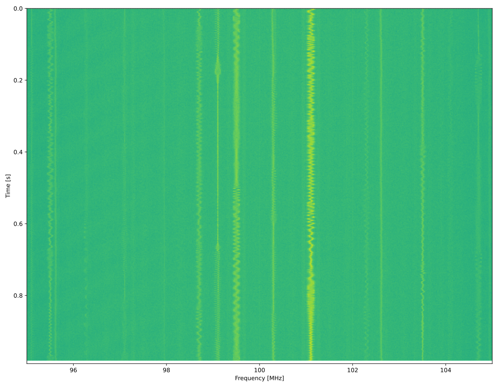

.. _hackrf-chapter:

############################
Робота з HackRF One в Python
############################

`HackRF One <https://greatscottgadgets.com/hackrf/one/>`_ від Great Scott Gadgets — це SDR-пристрій із USB 2.0, що може працювати як передавач або приймач у діапазоні від 1 МГц до 6 ГГц із частотою дискретизації від 2 до 20 МГц. Він був випущений у 2014 році та зазнав кількох незначних покращень. Це один із небагатьох недорогих SDR із можливістю передачі, що працює від 1 МГц, що робить його чудовим вибором для додатків у НЧ-діапазоні (наприклад, аматорського радіо) та роботи на вищих частотах. Максимальна вихідна потужність у 15 дБм також є вищою за більшість інших SDR, детальні характеристики передавання можна знайти `тут <https://hackrf.readthedocs.io/en/latest/faq.html#what-is-the-transmit-power-of-hackrf>`_. HackRF One працює в напівдуплексному режимі, тобто він або передає, або приймає в будь-який момент часу, і використовує 8-бітні АЦП/ЦАП.

.. image:: ../_images/hackrf1.jpeg
   :scale: 60 %
   :align: center 
   :alt: HackRF One

********************************
Архітектура HackRF
********************************

HackRF One побудований на основі чипа MAX2839 від Analog Devices — це приймач/передавач у діапазоні 2,3–2,7 ГГц, спочатку розроблений для WiMAX. Він працює в парі з RF-фронтендом MAX5864 (який містить АЦП і ЦАП) і широкосмуговим синтезатором RFFC5072 (який використовується для підняття та зниження частоти сигналу). На відміну від більшості недорогих SDR, які використовують єдиний чип RFIC, HackRF має іншу архітектуру. 

.. image:: ../_images/hackrf_block_diagram.webp
   :align: center 
   :alt: Блок схема HackRF One
   :target: ../_images/hackrf_block_diagram.webp

The HackRF One є високорозширюваним та легко модифікованим пристроєм. Усередині пластикового корпусу розташовані чотири роз'єми (P9, P20, P22 і P28), специфікацію яких можна `знайти тут <https://hackrf.readthedocs.io/en/latest/expansion_interface.html>`_,, але зверніть увагу, що на роз'ємі P20 розташовані 8 виводів GPIO і 4 аналогових входи ADC, тоді як SPI, I2C і UART знаходяться на P22. Роз'єм P28 можна використовувати для ініціалізації або синхронізації операцій передавання/приймання з іншими пристроями (наприклад, TR-перемикачем, зовнішнім підсилювачем або іншим HackRF) через тригерний вхід/вихід, із затримкою менш ніж один період вибірки.

.. image:: ../_images/hackrf2.jpeg
   :scale: 50 %
   :align: center 
   :alt: Друкована плата HackRF One

Тактовий сигнал, що використовується як для гетеродина (LO), так і для АЦП/ЦАП, отримується або від вбудованого генератора на 25 МГц, або від зовнішнього опорного сигналу 10 МГц, що подається через SMA-роз'єм. Незалежно від вибраного джерела тактування, HackRF генерує 10 МГц тактовий сигнал на виході CLKOUT; це стандартна квадратна хвиля 3,3 В 10 МГц, призначена для навантаження з високим опором. Порт CLKIN розрахований на прийом аналогічного 10 МГц сигналу (3,3 В квадратної форми), і HackRF One автоматично переключиться на вхідний сигнал замість внутрішнього генератора, коли виявить його (примітка: перехід на використання або відключення зовнішнього тактового сигналу через CLKIN відбувається лише під час початку операції передавання або приймання).

*********************************************************
Налаштування програмного та апаратного забезпечення
*********************************************************

Процес встановлення програмного забезпечення складається з двох етапів: спочатку ми встановимо основну бібліотеку HackRF від Great Scott Gadgets, а потім – Python API.

Встановлення бібліотеки HackRF
#############################

Наступні дії були протестовані та працюють на Ubuntu 22.04 (використовуючи коміт із хешем 17f3943 у березні 2025 року):

.. code-block:: bash

    git clone https://github.com/greatscottgadgets/hackrf.git
    git checkout 17f3943
    cd hackrf/host
    mkdir build
    cd build
    cmake ..
    make
    sudo make install
    sudo ldconfig
    sudo cp /usr/local/bin/hackrf* /usr/bin/.

Після встановлення :code:hackrf ви зможете використовувати такі утиліти:

* :code:`hackrf_info` – зчитує інформацію про пристрій HackRF, таку як серійний номер та версію прошивки.
* :code:`hackrf_transfer` – передача та прийом сигналів за допомогою HackRF. Вхідні/вихідні файли представлені у вигляді 8-бітних знакових квадратурних семплів.
* :code:`hackrf_sweep` – командний аналізатор спектра.
* :code:`hackrf_clock` – зчитування та налаштування параметрів тактового генератора.
* :code:`hackrf_operacake` – конфігурування комутатора антен Opera Cake, підключеного до HackRF.
* :code:`hackrf_spiflash` – утиліта для запису нової прошивки в HackRF. Див. розділ: Оновлення прошивки.
* :code:`hackrf_debug` – читання та запис регістрів, а також інші низькорівневі налаштування для налагодження.

Якщо ви використовуєте Ubuntu через WSL, вам потрібно буде переспрямувати USB-пристрій HackRF у WSL. Для цього спочатку встановіть останню версію утиліти <https://github.com/dorssel/usbipd-win/releases>`_ цей посібник передбачає використання usbipd-win версії 4.0.0 або новішої). Після встановлення відкрийте PowerShell від імені адміністратора та виконайте команду:

.. code-block:: bash

    usbipd list
    <Знайдіть BUSID, позначений як HackRF One, підставте його в наступні дві команди>
    usbipd bind --busid 1-10
    usbipd attach --wsl --busid 1-10

На стороні WSL ви повинні мати змогу виконати команду :code:`lsusb` і побачити новий пристрій з назвою:code:`Great Scott Gadgets HackRF One`.  Зверніть увагу, що ви можете додати прапорець :code:`--auto-attach` до команди: code:`usbipd attach` якщо хочете, щоб пристрій автоматично перепідключався. В кінці, вам потрібно додати правила udev, використовуючи наступну команду:

.. code-block:: bash

    echo 'ATTR{idVendor}=="1d50", ATTR{idProduct}=="6089", SYMLINK+="hackrf-one-%k", MODE="660", TAG+="uaccess"' | sudo tee /etc/udev/rules.d/53-hackrf.rules
    sudo udevadm trigger

Потім від’єднайте та знову підключіть ваш HackRF One (і повторно виконайте команду :code:`usbipd attach`).  Зверніть увагу: у мене виникали проблеми з правами доступу на наступному кроці, поки я не почав використовувати `WSL USB Manager <https://gitlab.com/alelec/wsl-usb-gui/-/releases>`_ на стороні Windows для керування переспрямуванням USB у WSL. Схоже, що цей інструмент також автоматично налаштовує правила udev.

Незалежно від того, використовуєте ви нативний Linux чи WSL, на цьому етапі ви повинні мати змогу виконати :code:`hackrf_info` і отримати щось подібне:

.. code-block:: bash

    hackrf_info version: git-17f39433
    libhackrf version: git-17f39433 (0.9)
    Found HackRF
    Index: 0
    Serial number: 00000000000000007687865765a765
    Board ID Number: 2 (HackRF One)
    Firmware Version: 2024.02.1 (API:1.08)
    Part ID Number: 0xa000cb3c 0x004f4762
    Hardware Revision: r10
    Hardware appears to have been manufactured by Great Scott Gadgets.
    Hardware supported by installed firmware: HackRF One

Давайте також зробимо IQ-запис FM-діапазону шириною 10 МГц, з центром на 100 МГц, та захопимо 1 мільйон семплів. Для цього виконайте наступну команду:

.. code-block:: bash

    hackrf_transfer -r out.iq -f 100000000 -s 10000000 -n 1000000 -a 0 -l 30 -g 50

This utility produces a binary IQ file of int8 samples (2 bytes per IQ sample), which in our case should be 2MB.  If you're curious, the signal recording can be read in Python using the following code:

.. code-block:: python

    import numpy as np
    samples = np.fromfile('out.iq', dtype=np.int8)
    samples = samples[::2] + 1j * samples[1::2]
    print(len(samples))
    print(samples[0:10])
    print(np.max(samples))

Якщо максимальне значення становить 127 (що означає насичення АЦП), зменшіть два параметри підсилення в кінці команди.

Встановлення Python API
#######################

Нарешті, потрібно встановити HackRF One `Python bindings <https://github.com/GvozdevLeonid/python_hackrf>`_, які підтримує `GvozdevLeonid <https://github.com/GvozdevLeonid>`_. Протестовані на Ubuntu 22.04 станом на 11.04.2024, з останньої версії  main-гілки.

.. code-block:: bash

    sudo apt install libusb-1.0-0-dev
    pip install python_hackrf==1.2.7

Ми можемо перевірити коректність встановлення, виконавши наступний код. Якщо помилок немає (і також немає виводу), значить, все налаштовано правильно!

.. code-block:: python

    from python_hackrf import pyhackrf  # type: ignore
    pyhackrf.pyhackrf_init()
    sdr = pyhackrf.pyhackrf_open()
    sdr.pyhackrf_set_sample_rate(10e6)
    sdr.pyhackrf_set_antenna_enable(False)
    sdr.pyhackrf_set_freq(100e6)
    sdr.pyhackrf_set_amp_enable(False)
    sdr.pyhackrf_set_lna_gain(30) # LNA підсилення - 0 to 40 dB in 8 dB steps
    sdr.pyhackrf_set_vga_gain(50) # VGA підсилення - 0 to 62 dB in 2 dB steps
    sdr.pyhackrf_close()

Щоб виконати фактичний тест захоплення IQ-семплів, використовуйте наступний код.

********************************
Tx та Rx підсилення
********************************

Прийом сигналу
##############

HackRF One при прийомі має три різні каскади підсилення:

* RF (:code:`amp`, вимкнуто 0 або увімкнуто підсилення на 11 dB)
* IF (:code:`lna`, від 0 до 40 дБ, з кроком 8 дБ)
* baseband (:code:`vga`, від 0 до 62 дБ з кроком 2 дБ)

Для прийому більшості сигналів рекомендується залишати RF-підсилювач вимкненим (0 дБ), якщо тільки ви не працюєте з надзвичайно слабким сигналом і поруч немає потужних сигналів. IF (LNA) підсилення є найважливішим каскадом підсилення для налаштування, щоб максимізувати SNR і уникнути насичення АЦП, це перший параметр, який слід коригувати. Підсилення базової смуги можна залишити на відносно високому рівні, наприклад, ми залишимо його на 50 дБ.

Передача сигналу
################

При передачі сигналу, є два різні каскади підсилення:

* RF [або 0 або 11 дБ]
* IF [від 0 до 47 дБ з кроком 1 дБ]

You will likely want the RF amplifier enabled, and then you can adjust the IF gain to suit your needs.

**************************************************
Receiving IQ Samples within Python with the HackRF
**************************************************

Currently the :code:`python_hackrf` Python package does not include any convenience functions for receiving samples, it is simply a set of Python bindings that map to the HackRF's C++ API.  That means in order to receive IQ, we have to use a decent amount of code.  The Python package is set up to use a callback function in order to receive more samples, this is a function that we must set up, but it will automatically get called whenever there are more samples ready from the HackRF.  This callback function always needs to have three specific arguments, and it needs to return :code:`0` if we want another set of samples.  In the code below, within each call to our callback function, we convert the samples to NumPy's complex type, scale them from -1 to +1, and then store them in a larger :code:`samples` array 

After running the code below, if in your time plot, the samples are reaching the ADC limits of -1 and +1, then reduce :code:`lna_gain` by 3 dB until it is clearly not hitting the limits.

.. code-block:: python

    from python_hackrf import pyhackrf  # type: ignore
    import matplotlib.pyplot as plt
    import numpy as np
    import time

    # These settings should match the hackrf_transfer example used in the textbook, and the resulting waterfall should look about the same
    recording_time = 1  # seconds
    center_freq = 100e6  # Hz
    sample_rate = 10e6
    baseband_filter = 7.5e6
    lna_gain = 30 # 0 to 40 dB in 8 dB steps
    vga_gain = 50 # 0 to 62 dB in 2 dB steps

    pyhackrf.pyhackrf_init()
    sdr = pyhackrf.pyhackrf_open()

    allowed_baseband_filter = pyhackrf.pyhackrf_compute_baseband_filter_bw_round_down_lt(baseband_filter) # calculate the supported bandwidth relative to the desired one

    sdr.pyhackrf_set_sample_rate(sample_rate)
    sdr.pyhackrf_set_baseband_filter_bandwidth(allowed_baseband_filter)
    sdr.pyhackrf_set_antenna_enable(False)  # It seems this setting enables or disables power supply to the antenna port. False by default. the firmware auto-disables this after returning to IDLE mode

    sdr.pyhackrf_set_freq(center_freq)
    sdr.pyhackrf_set_amp_enable(False)  # False by default
    sdr.pyhackrf_set_lna_gain(lna_gain)  # LNA gain - 0 to 40 dB in 8 dB steps
    sdr.pyhackrf_set_vga_gain(vga_gain)  # VGA gain - 0 to 62 dB in 2 dB steps

    print(f'center_freq: {center_freq} sample_rate: {sample_rate} baseband_filter: {allowed_baseband_filter}')

    num_samples = int(recording_time * sample_rate)
    samples = np.zeros(num_samples, dtype=np.complex64)
    last_idx = 0

    def rx_callback(device, buffer, buffer_length, valid_length):  # this callback function always needs to have these four args
        global samples, last_idx

        accepted = valid_length // 2
        accepted_samples = buffer[:valid_length].astype(np.int8) # -128 to 127
        accepted_samples = accepted_samples[0::2] + 1j * accepted_samples[1::2]  # Convert to complex type (de-interleave the IQ)
        accepted_samples /= 128 # -1 to +1
        samples[last_idx: last_idx + accepted] = accepted_samples

        last_idx += accepted

        return 0

    sdr.set_rx_callback(rx_callback)
    sdr.pyhackrf_start_rx()
    print('is_streaming', sdr.pyhackrf_is_streaming())

    time.sleep(recording_time)

    sdr.pyhackrf_stop_rx()
    sdr.pyhackrf_close()
    pyhackrf.pyhackrf_exit()

    samples = samples[100000:] # get rid of the first 100k samples just to be safe, due to transients

    fft_size = 2048
    num_rows = len(samples) // fft_size
    spectrogram = np.zeros((num_rows, fft_size))
    for i in range(num_rows):
        spectrogram[i, :] = 10 * np.log10(np.abs(np.fft.fftshift(np.fft.fft(samples[i * fft_size:(i+1) * fft_size]))) ** 2)
    extent = [(center_freq + sample_rate / -2) / 1e6, (center_freq + sample_rate / 2) / 1e6, len(samples) / sample_rate, 0]

    plt.figure(0)
    plt.imshow(spectrogram, aspect='auto', extent=extent) # type: ignore
    plt.xlabel("Frequency [MHz]")
    plt.ylabel("Time [s]")

    plt.figure(1)
    plt.plot(np.real(samples[0:10000]))
    plt.plot(np.imag(samples[0:10000]))
    plt.xlabel("Samples")
    plt.ylabel("Amplitude")
    plt.legend(["Real", "Imaginary"])

    plt.show()

When using an antenna that can receive the FM band, you should get something like the following, with several FM stations visible in the waterfall plot:

.. image:: ../_images/hackrf_time_screenshot.png
   :align: center 
   :scale: 50 %
   :alt: Time plot of the samples grabbed from HackRF

